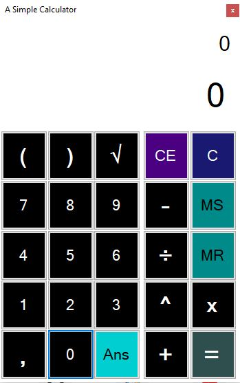
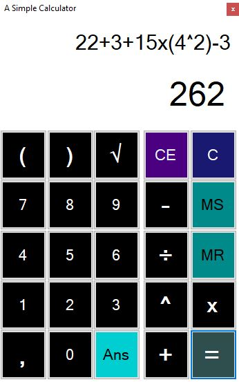
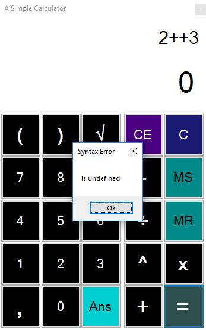

# CalcKubis

CalcKubis is a simple calculator application using winforms developed with .NET Framework made to assist cabbage merchant whose name is Fahmi. Fahmi needs the calculator to calculate how much he needs to charge Avatar Aang for breaking his cabbage because his old calculator was bought by IF 2018 student.

## Getting Started

These instructions will get you a copy of the project up and running on your local machine for development and testing purposes.

### Prerequisites

1. Windows Operating System\
[Windows 10](https://www.microsoft.com/en-us/software-download/windows10)

2. Visual Studio (any edition)\
[Visual Studio](https://visualstudio.microsoft.com/downloads/)

## Usage

### Using Visual Studio
1. Double click CalcKubis.sln or right click CalcKubis.sln -> open with Visual Studio
2. Click Start

### Using file.exe
1. Open folder bin
2. Run Calc_Kubis.exe

## Examples
### Program GUI

<kbd>

</kbd>

### Solving Math Expression

<kbd>

</kbd>

### Wrong Inputs

<kbd>
 
</kbd>

## Contributing
1. [William Ong](https://github.com/William9923)
2. [Aufa Fadhlurohman](https://github.com/aufaf29)
3. [Felix Setiawan](https://github.com/felixsetiawan)
4. [Aditias Alif Mardiano](https://github.com/Raven27th)
